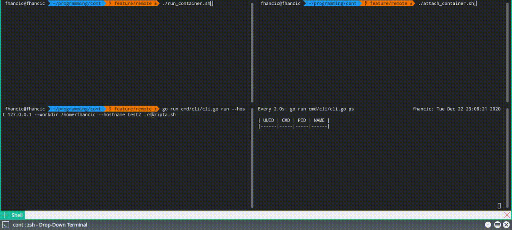
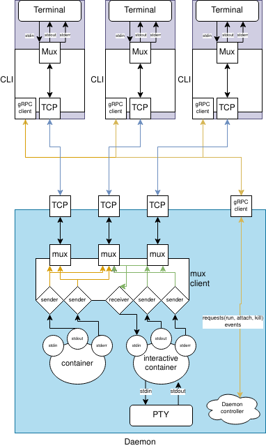

# Cont

A toy container runner & orchestrator.

Currently supports:

* running containers interactively (PTY) or in detached mode
* killing active containers
* listing active containers
* isolated mounts, network, user namespaces, process namespace...
* rootless containers by default
* custom container hostname

## Usage



Check out help with `go run cmd/cli/cli.go help`.

Examples:

* `go run cmd/cli/cli.go run --it bash` - run bash in an isolated container with a pseudo terminal
    * `go run cmd/cli/cli.go run --host <hostname> --it bash` - run bash in an isolated container with a pseudo terminal
      through a multiplexed TCP connection
* `go run cmd/cli/cli.go attach --it <container_id>` - attach to a running container
    * `go run cmd/cli/cli.go attach --host <hostname> --it <container_id>` - attacho to a container with a pseudo
      terminal through a multiplexed TCP connection
* `go run cmd/cli/cli.go ps` - list running containers
* `go run cmd/cli/cli.go --host <hostname> ps` - list running containers on a remote host

Daemon: `go run cmd/daemon/daemon.go`

## High level architecture

* CLI
    * communicates with daemons through gRPC and handles IPC
    * each interactive session is connected in a separate pseudo terminal and streams data in & out
* daemon
    * communicates with clients and runs the containers
    * TCP connections are multiplexed in multiple streams and stream container stdin, stdout & stderrs



## TODO

* [x] remote container orchestration (IPC through TCP sockets)
* [ ] inter-container networking
* [ ] running different OSes
* [ ] volume mounts
* [ ] contfiles & builds
* [x] killing containers through CLI (almost!)
* [ ] secure gRPC communication

## Remote IPC TODO

* [x] signalling container kill (reuse gRPC kill)
* [x] attach to a container
* [x] clean up multiplex module
* [x] clean up daemon & CLI codebase
* [x] dropped connection/stream detection & cleanup

## Examples

```bash
$ go run cmd/cli/cli.go run --it --name test123 --hostname kontejner --workdir /home/fhancic bash
$ whoami
root
$ hostname
kontejner
$ pwd
/home/fhancic

```

```bash
$ go run cmd/cli/cli.go ps
|                 UUID                 | CMD  |  PID   |  NAME   |
|--------------------------------------|------|--------|---------|
| 250c137e-a173-410e-8b81-1161e4979d04 | bash | 512306 |         |
| fc7467b9-d63d-4c05-b6fb-5a61458903ea | bash | 512088 | test123 |
```

## Acknowledgments

* https://github.com/google/goterm - I used a good portion of the code to get a grasp of how to set up a Linux PTY
* https://github.com/nsf/termbox-go - I used this as a reference for raw stdin reads
* https://github.com/lizrice/containers-from-scratch - a great starting point for isolation
* https://speakerdeck.com/lizrice/rootless-containers-from-scratch - rootless container runtime
* https://github.com/hashicorp/yamux - inspiration for a lot of multiplexing ideas
* https://github.com/spf13/cobra - used for building conts CLIs
* https://github.com/olekukonko/tablewriter - terminal table print outs
* gRPC & protobuf - for client-server communication, binary encoding/decoding of messages
