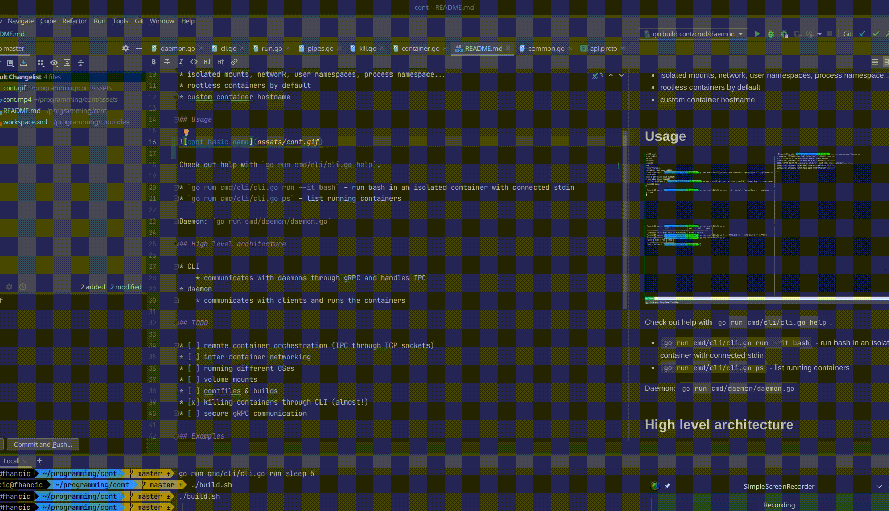

# Cont

A toy container runner & orchestrator.

Currently supports:

* running containers interactively (PTY) or in detached mode
* killing active containers
* listing active containers
* isolated mounts, network, user namespaces, process namespace...
* rootless containers by default
* custom container hostname

## Usage



Check out help with `go run cmd/cli/cli.go help`.

* `go run cmd/cli/cli.go run --it bash` - run bash in an isolated container with connected stdin
* `go run cmd/cli/cli.go attach --it <container_id>` - attach to a running container
* `go run cmd/cli/cli.go ps` - list running containers

Daemon: `go run cmd/daemon/daemon.go`

## High level architecture

* CLI
    * communicates with daemons through gRPC and handles IPC
* daemon
    * communicates with clients and runs the containers

## TODO

* [x] remote container orchestration (IPC through TCP sockets)
* [ ] inter-container networking
* [ ] running different OSes
* [ ] volume mounts
* [ ] contfiles & builds
* [x] killing containers through CLI (almost!)
* [ ] secure gRPC communication

## Remote IPC TODO

* [x] signalling container kill (reuse gRPC kill)
* [x] attach to a container
* [ ] clean up multiplex module
* [x] clean up daemon & CLI codebase
* [x] dropped connection/stream detection & cleanup

## Examples

```bash
$ go run cmd/cli/cli.go run --it --name test123 --hostname kontejner --workdir /home/fhancic bash
$ whoami
root
$ hostname
kontejner
$ pwd
/home/fhancic

```

```bash
$ go run cmd/cli/cli.go ps
|                 UUID                 | CMD  |  PID   |  NAME   |
|--------------------------------------|------|--------|---------|
| 250c137e-a173-410e-8b81-1161e4979d04 | bash | 512306 |         |
| fc7467b9-d63d-4c05-b6fb-5a61458903ea | bash | 512088 | test123 |
```